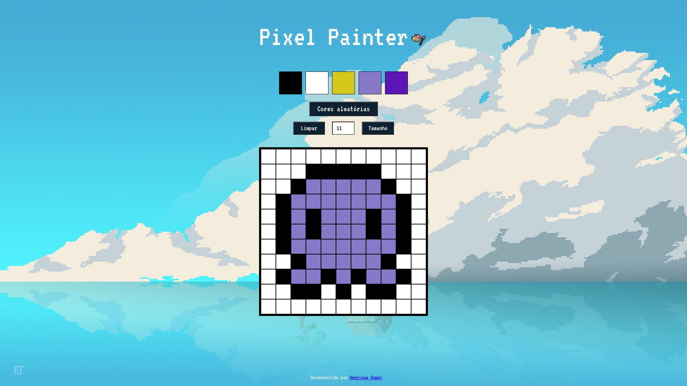

#  Pixels Painter - Aplicação de Arte em Pixel

## Visão Geral

O Pixels Painter é uma aplicação web de arte em pixel que permite aos usuários criar desenhos pixelados usando uma variedade de cores. Os usuários podem selecionar cores de uma paleta, desenhar em uma grade e salvar suas criações localmente. A aplicação também oferece recursos como gerar uma nova tela, limpar a tela atual e gerar cores aleatórias.

## Deploy e Imagens do Projeto

A aplicação está disponível online e pode ser acessada [aqui](https://pixel-painter-gamma.vercel.app/).

## Tecnologias e Técnicas Utilizadas

- **HTML**: A estrutura da página web é definida usando HTML.

- **CSS**: A apresentação e o layout da página web são estilizados usando CSS.

- **JavaScript**: A funcionalidade da aplicação é implementada usando JavaScript.
 
**Manipulação do DOM**: O projeto utiliza JavaScript para interagir com o Document Object Model (DOM) da página web. Isso permite a criação dinâmica de elementos HTML, a adição de event listeners e a atualização de estilos e conteúdos em tempo real.

**Armazenamento Local**: A aplicação faz uso do Local Storage do navegador para persistir o estado do quadro de pixels, a paleta de cores e o tamanho do quadro. Isso garante que os desenhos dos usuários sejam mantidos mesmo após a atualização ou fechamento da página.

**Geração de Cores Aleatórias**: Ao clicar no botão "Cores Aleatórias", a aplicação gera cores aleatórias em formato hexadecimal, proporcionando aos usuários uma ampla gama de opções de cores para escolher.

**Responsividade**: O tamanho do quadro de pixels é adaptado com base no tamanho da tela do dispositivo do usuário. Isso garante uma experiência consistente, independentemente do dispositivo utilizado para acessar a aplicação.

## Funcionalidades

**Paleta de Cores**: Os usuários podem selecionar cores de uma paleta para usar na pintura.

**Cores Aleatórias**: Existe um botão que gera cores aleatórias para a paleta.

**Tamanho do Quadro**: Os usuários podem escolher o tamanho do quadro em uma faixa de 5x5 a 12x12.

**Desenho**: Os usuários podem clicar em pixels individuais para preenchê-los com a cor selecionada. Os usuários podem clicar e arrastar para desenhar na tela.

**Persistência do Quadro**: O estado do quadro (cores dos pixels individuais) é salvo no armazenamento local, permitindo que os usuários revisitem seus desenhos mesmo após atualizar a página.

**Limpar o Quadro**: Há um botão para limpar todo o quadro.

## Como Usar

1. **Selecionar Cores**: Clique em uma cor na paleta para selecioná-la.

2. **Desenhar**: Clique em um pixel no quadro para preenchê-lo com a cor selecionada.

3. **Desenhar com Cores Aleatórias**: Clique no botão "Cores aleatórias" para gerar cores aleatórias para a paleta.

4. **Mudar o Tamanho do Quadro**:
   - Ajuste o número no campo de entrada.
   - Clique no botão "Tamanho" para gerar um novo quadro.

5. **Limpar o Quadro**: Clique no botão "Limpar" para limpar todo o quadro.

6. **Salvar e Recarregar**:
   - O estado do quadro é salvo automaticamente no armazenamento local.
   - Você pode recarregar a página e seu desenho ainda estará lá.
